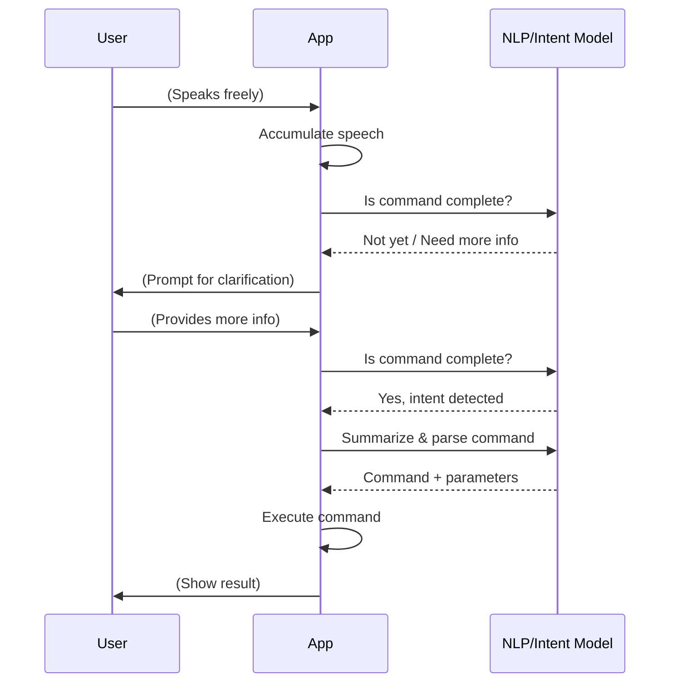

# Speech-to-Note: Voice-Driven Note Management App

## Project Idea

This project aims to build a Python-based application that allows users to:
- Convert speech into text notes (voice-to-note).
- Organize notes in a tree structure, where each note can have sub-notes (children).
- Create and visualize relations between notes (e.g., parent-child, reference, dependency).
- Search across all notes using keywords or voice queries.
- Summarize notes or groups of notes for quick overviews.
- **Mark notes as done, storing the completion date for each completed node.**
- Eventually, package the app as an APK to run on Android devices (no Play Store upload required).

The app is designed for users who want to quickly capture ideas, tasks, or knowledge using their voice, and then manage, relate, and review them efficiently.

---

## Installation

Before running the app, install all dependencies using:

```sh
pip install -r requirements.txt
```

If you are on macOS and encounter issues with PyAudio, you may need to run:

```sh
brew install portaudio
pip install pyaudio
```

---

## Example: Task Tree for [Fiat Tipo (car maintenance tasks)]

Below is a prettified example of how notes can be structured as a tree, using your attached `notes.md` as a reference:

```
[Fiat Tipo]
├── [Make yearly test]
│   ├── [Fix steering]
│   │   └── [Send to repair]
│   └── [Fix AirBox]
│       ├── [Buy Airbox]
│       └── [Create brackets]
│           └── [Buy iron plate 2mm]
└── [Change Oil]
    └── [Buy oil from: ...]
```

Each level represents a deeper node in the tree, and each note is a node (leaf or branch).

---

## Types of Relations Between Notes

In addition to the parent-child (tree) structure, the following relation types are proposed:
- **Reference**: One note references another (e.g., "See also: [Change Oil]").
- **Dependency**: One note must be completed before another (e.g., "Buy Airbox" depends on "Fix AirBox").
- **Tag/Label**: Notes can share tags for cross-cutting concerns (e.g., "maintenance", "purchase").
- **Link**: Arbitrary links between notes for non-hierarchical associations.

---

## Marking Notes as Done

Each note can be marked as "done" when completed. When a note is marked as done, the app will store the date of completion. This allows users to track progress and review when tasks were finished.

**Data Model Addition:**
- Each note will have:
  - `done` (boolean): Whether the note is completed.
  - `done_date` (datetime, optional): The date and time when the note was marked as done.

---

## Project Structure Proposal

To support both development and future APK packaging, the following structure is suggested:

```
speech_to_note/
├── app/                  # Main application code (Python/Kivy or BeeWare)
│   ├── __init__.py
│   ├── main.py
│   ├── models/           # Note, Relation, Tree structures
│   ├── views/            # UI components
│   ├── controllers/      # Logic for speech, search, summarize
│   └── utils/            # Helpers (e.g., speech-to-text, summarization)
├── data/                 # User notes, relations, and settings
├── tests/                # Unit and integration tests
├── requirements.txt      # Python dependencies
├── README.md             # Project overview (this file)
└── build/                # APK build scripts and outputs
```

- **Kivy** or **BeeWare** are recommended frameworks for Python-to-APK conversion.
- For speech recognition, consider using `SpeechRecognition` and `pyttsx3` (offline TTS).
- For note storage, use local files (JSON, SQLite) for privacy and offline use.

---

## Backend/Server Considerations

If you want to sync notes across devices or add collaboration, you might consider using a lightweight backend (MCP server or similar). However, for privacy and offline-first use, a local-only solution is preferred. If you do want a backend:
- Look for open-source note-taking servers (e.g., Joplin Server, Standard Notes, or a minimal REST API).
- Ensure the backend supports custom relations and tree structures.

---

## Next Steps

- [done] Define the data model for notes and relations, including the 'done' and 'done_date' fields.
- [done] Choose the Python mobile framework (Kivy or BeeWare).
- [done] Implement core features: speech-to-text, note creation, tree navigation, search, summarization, and marking notes as done.
- [done] Design a simple, touch-friendly UI.
- [done] Prepare for APK packaging and Android deployment.

---

This README provides a clear vision, a concrete example, and a practical roadmap for your project! 


Project plan:
1. Record voice from a user via micraphone
1.1 We want to support hebrew and english languge
1.2 We are recording user speech upon we have a silent 
1.3 When voce record has done, we should start to processing the voice to text.
1.4 For each supported langue we will have dedicated converter/processor for it
1.5 project structure include directories and files

Stage I

1. Build basic shell application in Python which compiles to APK package [flow readme instruction]
2. In the shell application build chat application with user text input and show history conversation with AI agent. [consider to use web framework to simplefy things, maybe some other framework]
3. Add to the chat microphone option that when a user press it start recording voice till silence for 4 seconds. Threshold for the maximum length of for recording is 5 minutes [it's intend shouldn't be long, because a user should concise about he is instructions]
4. In the first stage application will support hebrew language or english
5. The record from user would be process via LLM in order to handle users notes
6. User will have predefined command such as im additional to the natural language capabilities:
  * Create note
  * Find note
  * Update note [1. set_status_done, 2. Update description, 3. Update relations, 4. update tags]
  * Delete note
7. Also the application should have a settings section to set all the tings that mentioned above

* For the metadata please use `notes.json` with examples
* For tree notes structure use example from `notes.md`

Stage II
1. Add summary of the records each day at the predefined time by user
2. Find common thing that could be optimize actions based on open notes 

# Note Speaker (Kivy Edition)

A speech-to-text application built with **Kivy** for cross-platform Python GUI development and **Buildozer** for Android APK packaging.

## Features

- **Speech Recognition**: Uses Google's speech recognition API
- **Cross-Platform**: Runs on Windows, macOS, Linux, and Android
- **Simple UI**: Clean button and text display interface
- **Real-time Feedback**: Shows listening status and transcribed text

## Requirements

### Desktop Development
- Python 3.7+
- Kivy 2.0+
- SpeechRecognition library
- PyAudio for microphone access
- Internet connection for Google Speech API

### Android Building (Additional)
- Buildozer
- Android SDK/NDK (auto-downloaded by Buildozer)
- Linux or macOS (Windows requires WSL)

## Installation

### 1. Install Dependencies

```bash
pip install -r requirements.txt
```

### 2. Install System Dependencies (macOS)

```bash
# Install system audio dependencies
brew install portaudio

# For Buildozer (Android builds)
brew install autoconf automake libtool pkg-config
```

### 3. Install System Dependencies (Ubuntu/Debian)

```bash
# Install system audio dependencies
sudo apt update
sudo apt install portaudio19-dev python3-pyaudio

# For Buildozer (Android builds)
sudo apt install -y git zip unzip openjdk-8-jdk python3-pip autoconf libtool pkg-config zlib1g-dev libncurses5-dev libncursesw5-dev libtinfo5 cmake libffi-dev libssl-dev
```

## Running the App

### Desktop (Development)

```bash
python main.py
```

### Android (APK Build)

#### 1. First-time Setup

```bash
# Initialize buildozer (creates buildozer.spec)
buildozer init

# Install Buildozer dependencies
pip install buildozer

export LDFLAGS="-L/opt/homebrew/opt/openssl@3/lib"
export CPPFLAGS="-I/opt/homebrew/opt/openssl@3/include"
export PKG_CONFIG_PATH="/opt/homebrew/opt/openssl@3/lib/pkgconfig"
```

#### 2. Build Debug APK

```bash
docker run --rm --platform linux/amd64 -v "$PWD":/src -w /src ghcr.io/kivy/buildozer:latest -v android debug
```
**Note: when buldozer tool asking to install openssl, say "no" beacuse he is trying to install oudated 
openssl library (openssl@1.1)** 

This will:
- Download Android SDK and NDK automatically
- Install all dependencies 
- Build the APK
- Place the APK in `./bin/` directory

#### 3. Build and Deploy to Connected Device

```bash
# Build and install on connected Android device
buildozer android debug deploy

# Build, install, and run on device
buildozer android debug deploy run
```

#### 4. Build Release APK (for distribution)

```bash
buildozer android release
```

## Project Structure

```
note-speeker/
├── main.py              # Main Kivy application
├── buildozer.spec       # Buildozer configuration
├── requirements.txt     # Python dependencies
├── README.md           # This file
├── notes.json          # Sample data structure
├── notes.md            # Project notes
└── bin/                # Built APK files (created after build)
```

## Configuration

### Buildozer Configuration (`buildozer.spec`)

Key settings for your app:
- **Title**: Note Speaker
- **Package**: com.yorikya.notespeaker  
- **Requirements**: python3,kivy,speechrecognition,pyaudio
- **Permissions**: INTERNET, RECORD_AUDIO
- **Target API**: 33 (Android 13)
- **Min API**: 21 (Android 5.0)

### App Requirements (`requirements.txt`)

```
kivy>=2.0.0
SpeechRecognition>=3.8.1
PyAudio>=0.2.11
buildozer>=1.4.0
```

## Usage

1. **Launch the app** (desktop or Android)
2. **Press "Start Listening"** button
3. **Speak clearly** into the microphone
4. **View transcribed text** in the label area
5. **Press again** to listen for more speech

## Android Permissions

The app requires:
- **INTERNET**: For Google Speech Recognition API
- **RECORD_AUDIO**: For microphone access

## Troubleshooting

### Common Issues

#### PyAudio Installation Errors (macOS)
```bash
brew install portaudio
pip install pyaudio
```

#### PyAudio Installation Errors (Ubuntu)
```bash
sudo apt install portaudio19-dev python3-pyaudio
pip install pyaudio
```

#### Buildozer Build Errors
```bash
# Clean build cache
buildozer android clean

# Try building again
buildozer android debug
```

#### Android Permissions
Make sure your Android device allows microphone access for the app.

### Build Requirements

For Android builds, Buildozer will automatically download:
- Android SDK (API 33)
- Android NDK (25b)
- Gradle build system
- Required dependencies

**Note**: First build may take 20-30 minutes and requires ~4GB disk space.

## References

- [Kivy Documentation](https://kivy.org/doc/stable/)
- [Buildozer Documentation](https://buildozer.readthedocs.io/)
- [Kivy Android Packaging Guide](https://kivy.org/doc/stable/guide/packaging-android.html)
- [Python Speech Recognition](https://pypi.org/project/SpeechRecognition/)

## License

MIT License - see LICENSE file for details.

# Note Speaker

A voice-controlled note-taking application with natural language processing capabilities.

## Features

- Voice-to-text note taking
- Natural language processing for note management
- Support for Hebrew and English
- Interactive graph visualization of notes
- Modern Material Design UI

## Setup

1. Install Python dependencies:
   ```bash
   pip install -r requirements.txt
   ```

2. Set up environment variables:
   - Create a `.env` file in the project root
   - Add your Gemini API key:
     ```
     GEMINI_API_KEY=your_api_key_here
     ```
   - Get your API key from: https://ai.google.dev/tutorials/setup

3. Run the application:
   ```bash
   python main.py
   ```

## Usage

1. Click the "Record" button to start recording
2. Speak your note or command
3. The application will process your speech and:
   - Create new notes
   - Update existing notes
   - Delete notes
   - Find notes
   - Show relationships between notes

## Voice Commands

Examples of voice commands:
- "Create a new note about the meeting tomorrow"
- "Add 'bring documents' to my meeting notes"
- "Show me my shopping lists"
- "Delete the old meeting notes"

## Configuration

The application supports the following environment variables:
- `GEMINI_API_KEY`: Required for natural language processing
- `SILENCE_TIMEOUT`: Time in seconds to wait for silence before stopping recording (default: 5)
- `RECORDING_TIMEOUT`: Maximum recording time in seconds (default: 600)
- `DEFAULT_LANGUAGE`: Default UI language (default: en-US)
- `DEFAULT_SPEECH_LANGUAGE`: Default speech recognition language (default: en-US)

## Development

The application is built with:
- Kivy for the UI framework
- KivyMD for Material Design components
- Google Cloud Speech-to-Text for voice recognition
- Google Gemini for natural language processing
- D3.js for graph visualization

# User / Agent conversation 
`
1. משתמש: תמצא רשימת קניות
2. סוכן: נמצאו רשומה 1
3. סוכן: האם תירצה לעדכן או למחוק רשומה?
4. משתמש: כן תעדכן את התוכן - רשומה זאת משמשת לשמור רשימת קניות שבועית
5. סוכן: לעדכן תוכן של רשימת קניות ל - רשומה זאת משמשת לשמור רשימת קניות שבועית
6. משתמש: כן
7. סוכן: התוכן של רשימת קניות עודכן
`

## License

MIT License

---

## Building APK with the Official Buildozer Docker Image

You can build your APK in a clean Linux environment using the official Buildozer Docker image, which avoids most macOS/Windows compatibility issues and works on both amd64 and arm64 (Apple Silicon).

### 1. Pull the Official Image (if needed)

```sh
docker pull ghcr.io/kivy/buildozer:latest
```

### 2. Build Your APK

From your project directory, run:

```sh
docker run --rm --platform linux/amd64 -v "$PWD":/src -w /src ghcr.io/kivy/buildozer:latest -v android debug
```

- This will mount your project into the container and run the build.
- The resulting APK will appear in your `bin/` directory.
- **Note:** The `--platform linux/amd64` flag is required on Apple Silicon (M1/M2) and ARM64 systems to enable 32-bit library support for Android build tools.

### 3. (Optional) Add Extra System Dependencies

If you need extra system packages, you can create a custom Dockerfile based on this image (see previous instructions).

---

This approach gives you a portable, repeatable build environment and avoids most platform-specific issues.

## Example: Conversational Command Understanding Flow

Below is an example of how the new conversational command understanding logic works:


